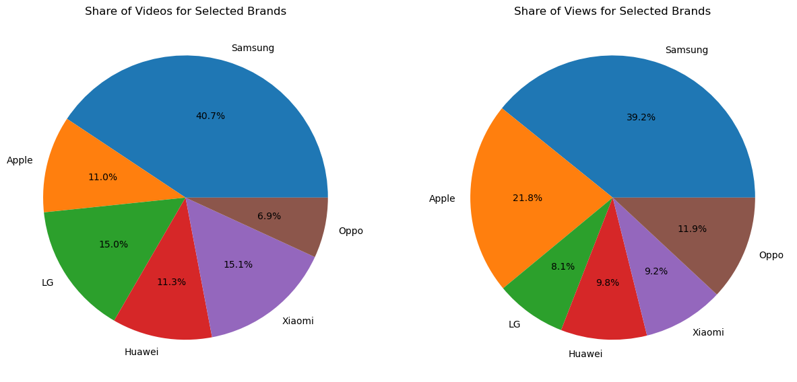
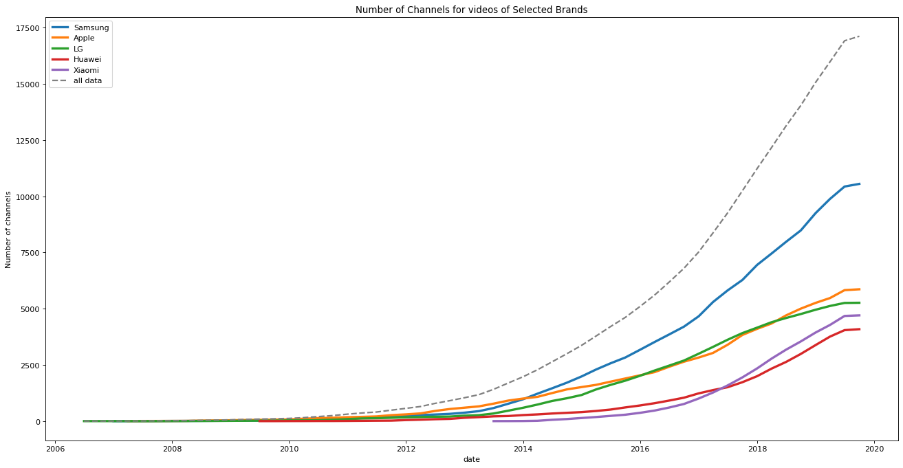
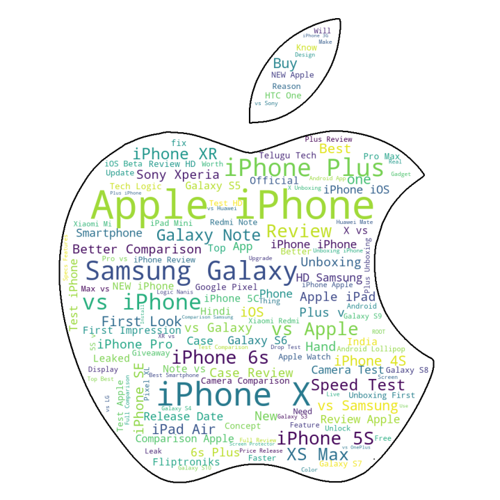

<h1 align="center">Hi ADA readers!</h1>

# Less is more: Free marketing for Apple

## Abstract :memo:
  Youtube is extremely popular in the tech sphere, with reliable tech reviews which have a significant impact on consumer choices. For the purpose of this project we       selected some of the top phone companies: Apple, Samsung, LG, Huawei, Xiaomi and Oppo. We would like to analyze how different companies enjoy ‘free marketing’ meaning how Youtube videos cover their smartphone release. More specifically, our focus will be on how Apple, being the largest and most influential of these companies, compares in video content production by YouTubers. Apple is one of the most talked about companies in traditional media despite releasing fewer products than its competitors. We want to find out if there is a systematic trend in coverage and viewership of news related to Apple’s ‘less is more’ product release business strategy.
  
## Research Questions :grey_question:
<!---
A list of research questions you would like to address during the project.
--->
 1. How does the coverage of Apple compare with the competitors through time? In particular, how many videos and channels cover Apple smartphones compared to its competitors, and how does this trend change over time?
 2. Does Apple's "Less is More" Marketing Strategy work?

 

## Additional Datasets :bookmark_tabs:
<!---
List the additional dataset(s) you want to use (if any), and some ideas on how you expect to get, manage, process, and enrich it/them.
Show us that you’ve read the docs and some examples, and that you have a clear idea on what to expect. Discuss data size and format if relevant.
It is your responsibility to check that what you propose is feasible.
--->
**Youniverse**: dataset provided in the scope of the ADA course. This dataset contains many different tables but, for the purpose of this project, we are only going to use the yt_metadata_en.jsonl.gz file which contains metadata related to ~73M videos from ~137k channels. This data was crawled from YouTube between 2019-10-29 and 2019-11-23.

**Phone to Smartphone**: this dataset was taken from this [GitHub Repo](https://github.com/ilyasozkurt/mobilephone-brands-and-models). It is device specifications crawled from [GSMArena](https://www.gsmarena.com/). It contains data about smartphones released between 1994 and 2021 such as their model, release date, announcement date, as well as their detailed hardware specifications. As explained in more detail in the “data pre-processing” section, we had to process and modify some features of this dataset in order to carry out our analysis.
  
## Methods :bulb:
**STEP 1: data pre-processing and feature engineering:**
The main  goal of this preprocessing was to be able to filter out the videos that did not talk about smartphones and to associate to each video talking about smartphones the name of the brand of smartphones the video was talking about:
  1. *Filter videos* : The first step in our data pre-processing consisted in removing the videos that had obviously no link to smartphones. In order to do this, we decided to only retain the videos included in the “Science and Technology” category of youtube. This allowed us to reduce the size of our dataset, which was considerable, and thus to decrease the processing time of the following steps. 
  2. *Filter phones* : The second step was to load and clean the phone data. This was done because it would help us, in the third step, to classify our youtube videos        according to the brands mentioned in the video. This filtering was accomplished via the following steps:  
      - The first thing we did was to remove all the phones that were never released. These are phones that were meant to be released but that ended up being abandoned.  
      - After that, and in preparation of the merge that we were planning to make with the Youniverse data, we filtered the data and only kept the phones that were            released between 2005 and 2019. This interval corresponds to time spanned by the videos metadata contained in the Youniverse dataset.  
      - We furthermore had to do some adjusting of the dates contained in the data. As an example, this means that quarter 1, which consists of the months of January,         February and March, would be replaced by the month of February. This is not far-fetched given that a quarter only consists of three months. Consequently, the           approximation is quite accurate. 
      - Finally, some dates contained typos which prevented us from simply and directly converting the corresponding columns to a date format. We thus had to spend some time fixing these typos with the help of regular expressions.  
  3. *Create the keywords associated to each brand* : The goal of all this pre-processing of our data was to eventually be able to know which video mentioned which brand. To do this, the methodology chosen was to create a list of keywords associated to each brand and to, then, look at each video to see if its title, description or tags contained one of the keywords associated to a given brand. If it did, we would add this brand to the list of brands associated to this video. The tricky part was to create the list of keywords associated to each brand. to do this, we did the following :
     - for each brand, consider all models released between 2005 and 2019
     - take these models names and exclude all those that were names of tablets
     - take the remaining models names and include them as well as transformations of them into the list. We need to do this because most of the time, when a phone is mentioned, its full name is not used but a variation of it is used instead. As an example, a lot of videos will talk about the “new Iphone” and not explicitly the “Iphone XS MAX”. The transformations we applied thus consist mainly in taking substrings of the model name.
  
   4. *Join phone and videos data* : In this final step of pre-processing, we joined the phone and video data.
      - For each video, we tried to deduce if it was talking about a specific brand of phones. To do this we searched through its textual fields such as the title, the        video description and the tags of the video and tried to see if the words contained there matched the “key-words" associated with one of the smartphone brands        that we are interested in.
      - After the last step, we naturally filtered the data one last time and only kept the videos which had matched at least one smartphone brand.

**STEP 2: stats and visualization:**
Once the videos were classified with respect to the smartphone brands mentioned in them, we were able to start calculating statistics of this data some of which we show  below as an example :

  

	
**STEP 3: time series analysis and visualization:**
Having our processed dataset allowed us to understand better that data and how to navigate it. In particular, we found that indexing our data frame of videos with respect to the videos release date made the computation of time-series statistics particularly convenient. Leveraging this, we were able to compute time-dependent statistics some of which we show below as an example:

  

 
Then we have done a time series analysis with the purpose of identifying the popularity of the different brands on YouTube using the number of views that each brand has got; then we have compared these trends.

**STEP 4: Fancy words:**
As a further step, we identified the words that are most common in the titles of phone videos for each company and plotted the results. The image below is an example of this analysis:

  

## Data Story
Please take a look at our data story [here](https://ahmad-jarrar.github.io/ada_story/#).

## Proposed timeline :clock10:
**Warning:** We noticed that some videos about specific phone brands like Oppo, include in their tags also more famous brands like Apple or Samsung (due to visualizations), and this causes data poisoning. Since the code to associate the brand to each video required 2 days to run, and since we discovered this problem one day before the deadline we are going to rerun the code to get a more clean dataset by the third milestone. Meanwhile we did the same analysis that we would do with the clean dataset since the only difference would be a slightly more accurate result.
* 20.11.22 Solve data poisoning because of the tags.
* 21.11.22 Re-do the plots with the cleaned dataset.
* 22.11.22 Pause project work.
* 02.12.22 **Homework 2 deadline**
* 03.12.22 Add confidence intervals using bootstrapping.
* 05.12.22 Perform final analyses.
* 10.12.22 Begin developing a rough draft of the datastory.
* 12.12.22 Complete all code implementations and visualisations relevant to analysis.
* 16.12.22 Complete datastory.
* 23.12.22 **Milestone 3 deadline**

## Team Organization :raised_hands:
<!---
A list of internal milestones up until project Milestone 3.
--->
<table class="tg" style="undefined;table-layout: fixed; width: 342px">
<colgroup>
<col style="width: 164px">
<col style="width: 178px">
</colgroup>
<thead>
  <tr>
    <th class="tg-0lax"></th>
    <th class="tg-0lax">Tasks</th>
  </tr>
</thead>
<tbody>
  <tr>
    <td class="tg-0lax">@Ahmad</td>
    <td class="tg-0lax">Web interface  Sentiment analysis  Develop the final text for the data story</td>
  </tr>
  <tr>
    <td class="tg-0lax">@Ilyas</td>
    <td class="tg-0lax">Stats analysis  Continue the time series analysis  Develop the final text for the data story</td>
  </tr>
  <tr>
    <td class="tg-0lax">@Miguel</td>
    <td class="tg-0lax">Refinement of the plots  Sentiment analysis  Develop the final text for the data story</td>
  </tr>
  <tr>
    <td class="tg-0lax">@Emanuele</td>
    <td class="tg-0lax">Refinement of the plots  Continue the time series analysis  Develop the final text for the data story</td>
  </tr>
</tbody>
</table>

  
  
  
